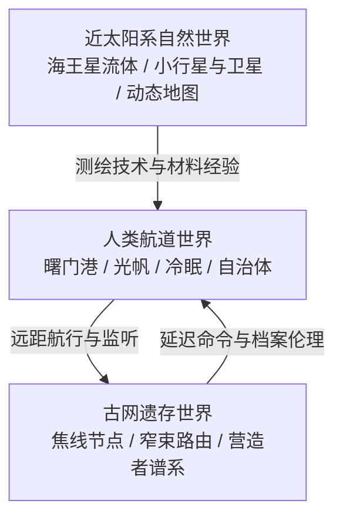

# 世界观总览

## 工作定义

这是一个没有超光速、没有全知中心、也没有可靠“现在”的太阳系文明。它已经能把人和仪器送到行星深处与太阳焦线，却仍只能把一句最简单的话交给光，等待对方在很久以后决定是否接住。

## 三层世界

### 第一层：自然不是静态背景 [A/B]

海王星没有表面，焦线没有土地，焦点附近的石冢也没有“房间”或“驾驶舱”。这里的地理由流体密度、温度、压力、焦距、辐射和光线构成。人类先学会为无岸之海画地图，后来才有能力把焦线称作“岸”。

### 第二层：航道是制度的延伸 [A]

港口、推光阵列、磁帆制动、冷眠舱和通信协议把太阳系连起来，却没有消除距离。航线越长，命令越像历史记录；远征船必须在没有实时授权的情况下承担决定，回程再接受已经改变的社会审判。

### 第三层：古网是被自然化的技术 [A/B]

游荡营造者没有中央城市、国旗或设计图。它们依靠复制、局部修复和引力透镜把节点一站站铺开。对人类而言，这套网络首先像自然史对象，随后才像通信基础设施；它的“生命”与“机器”边界始终无法稳定。

## 四条硬规则

1. **光速是因果边界。** 任何消息都可能在抵达前失去发送者、收件人或合法性。
2. **测量有成本。** 每一份样本、档案、燃料和冷眠冗余都占质量；探索不是免费增加知识。
3. **校验不能替代基准。** 三重校验若共用一只错误的钟，反而会把错误变成共识；“第一项为零”是工程和伦理共同的警句。
4. **接触必须包含终止权。** 让一个节点知道人类存在，不等于取得占有、复制或继续发送的许可。

## 两篇作品的兼容桥梁 [B]

`蔚蓝深渊航海记`可以被视作海王星深层勘测纪元的代表性档案，`焦岸`则发生在外行星航道和自治体已经成熟之后。最稳妥的连接不是安排人物亲属关系，而是让知识和制度留下痕迹：

- 海王星的动态等温面图成为曙门港航海学校的教材。
- 真空蜂室、主动应力骨架和高压材料谱被后来的磁帆/隔离甲工程继承。
- 博物学家兼测绘员这一职位逐渐扩大为“宇宙自然史”学科，许岑正是在这个传统中研究营造者。
- “没有表面不等于没有世界”演化为远征伦理；石冢则把“没有主人不等于没有责任”补成另一半。

这些连接是资料库的 B 级方案，不会改动任何原文。

## 故事尺度

未来作品可以在三种尺度之间切换：

| 尺度 | 典型场景 | 冲突来源 |
| --- | --- | --- |
| 舱内 | 冷眠舱、气闸、日志室、家庭信件 | 资源、误差、信任、身体 |
| 航道 | 港口、推光阵列、自治体、迟到命令 | 法律滞后、政治断裂、回头路 |
| 深时 | 古网节点、七千万年档案、协议演化 | 继承、身份、终止、无人承担的后果 |

## 世界观的中心句

人类不是因为终于听见宇宙而长大，而是因为学会在听见以后仍允许对方拒绝。

