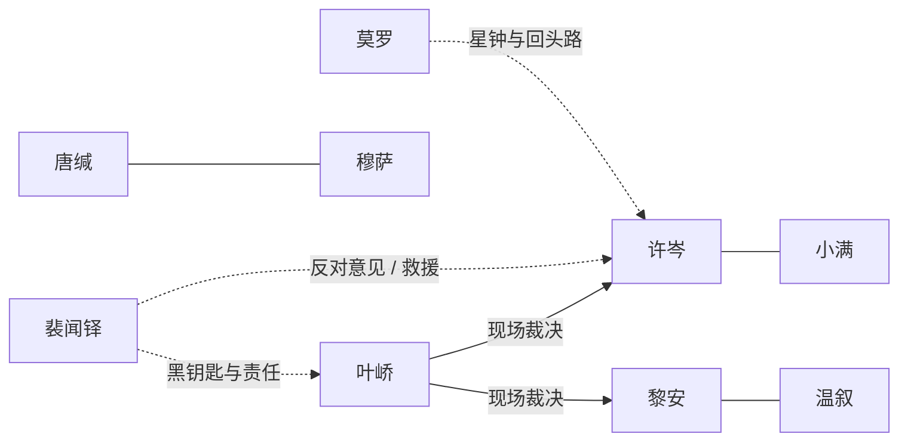

# 人物与关系

> 本页只整理已有文本中的人物。没有为 `蔚蓝深渊航海记` 的未命名成员补造姓名。

## 子午号六名返航者与一名死者

| 人物 | 职能 | 公开动机 | 关键选择 / 结果 |
| --- | --- | --- | --- |
| **许岑** | 随船博物学者、记录者 | 研究未被命名的事物；逃避具体的失去 | 记录石冢与营造者网络，删去最后内容包加密层，最终收到小满回信 |
| **叶峤** | 船长 | 让所有人回来；让现场责任有署名 | 在远方命令失效时组织投票，支持并裁决第四方案 |
| **亚历山大·莫罗** | 领航员 | 抵达但永远保留回头路 | 因冷眠时基误差死亡；留下脉冲星模型，成为定着协议的独立时基 |
| **穆萨** | 轮机长 | 让会坏的东西先被隔离、再被理解 | 设计单向材料板，反对无边界投料，切断复制母线；轻度辐射灼伤 |
| **唐缄** | 船医 | 先救活着的人，并承认医疗许可的责任 | 发现共用主钟风险，承认自己签过旧报告，守气闸并完成污染处置 |
| **黎安** | 通信官 | 让信息抵达具体的人，尤其是温叙 | 曾在越权阶段把温叙加入人类识别包，后来接受共同边界，最终带温叙的名字回家 |
| **裴闻铎** | 理事会专员、零级密钥持有人 | 让决定留下可追责的名字，完成理事会的永久见证 | 曾隐瞒主钟提示并支持完整激活；在 62.1% 时松锁救许岑，保留反对意见并承担审理 |

## 家属与未在船上的人

| 人物 | 与任务的关系 | 已知状态 | 备注 |
| --- | --- | --- | --- |
| **小满** | 许岑的女儿，白塔城教师 | 白塔城穹顶破裂后迁往谷神星地下城，仍活着并教书 | 她的“收到”不是替过去原谅，而是对现在作出回答 |
| **温叙** | 黎安的配偶 | 在卡利斯托阵列相关死者名单中确认死亡 | 二人在木卫三登记结婚；后续原文确认温叙与卡利斯托阵列防务及死亡名单相关，中间经历未写 |
| **莫罗的母亲** | 领航员家属 | 请求带回莫罗手画的星图，而非只带委员会结论 | 把具体的人从制度档案中重新叫回来 |
| **许岑的母亲** | 许岑远航动机的来源 | 已去世 | 许岑承认自己曾用宏大研究回避具体的失去 |

## `蔚蓝深渊航海记` 远征队

| 角色 | 文本给出的信息 | 资料库处理 |
| --- | --- | --- |
| 第一人称记录者 | 博物学家兼测绘员，记录温度、压力、成分和未见之物 | 不与许岑合并；可视为同一职业传统的前辈或平行记录者 [B] |
| 杜瓦尔 | 坚忍号船长 | 负责下潜、返航和全员表决；不补充姓氏之外的背景 |
| 伊琳娜 | 气象员 | 负责云层、闪电与能见度判断 |
| 工程师、领航员、值班军官、炊事员 | 在日志中承担各自航行工作 | 保留匿名，避免把空白误写成设定 |
| 乌尔班教授 | 远征赞助人，暖流以其名命名 | 只确认赞助与命名关系 |

## 关系图

## 人物书写约束

- 莫罗不应被写成“死后全知的钥匙”；他的星钟只解决一个独立时基缺口。
- 裴闻铎不是单纯反派。他的错误、动机和后续救援都必须同时保留。
- 黎安的悲伤不能只作为推动剧情的燃料；温叙是否被命名、被保存、被拒绝正是她的伦理选择。
- 许岑的博物学观察不是中立的上帝视角；她承认自己每次测量和取样都已改变对象。
- `蔚蓝`的匿名成员不能在没有新证据时与子午号成员建立亲属关系。
