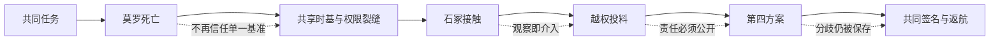

# 子午号群像与决策链

> 这不是“谁对谁错”的结论表，而是人物在每个时点拥有何种信息、作出何种选择、又把何种后果交给后来的记录。

## 七人各自守护的东西 [B]

| 人物 | 最先守护的对象 | 被任务迫使学会的事 |
| --- | --- | --- |
| 许岑 | 不被命名的深时对象 | 具体的人不能由宏大记录替代 |
| 叶峤 | 全船返航与现场秩序 | 多数行动仍要承认少数与空席 |
| 莫罗 | 航线与回头路 | 起点也需要独立校验 |
| 穆萨 | 机器和材料边界 | 限制不是抹除，取用会留下责任 |
| 唐缄 | 仍活着的身体 | 风险报告必须对应到具体病人 |
| 黎安 | 能够抵达具体人的消息 | 保存姓名不能替姓名的主人同意 |
| 裴闻铎 | 可追责的决定与永久见证 | 档案的完整不能先于眼前的人 |

## 决策时间表 [A/B]

| 阶段 | 现场事实 | 主要分歧 | 人物变化 |
| --- | --- | --- | --- |
| 出发与推光 | 远钟用途保密，深空目标只是一缕低语 | 是否把远方任务当作所有人的共同任务 | 许岑尚把远航当作逃离具体生活；裴闻铎相信零级保全 |
| 莫罗死亡 | 共享主钟误差、七号舱降级、远钟供能升甲 | 先尸检、先隔离、还是先打开远钟 | 穆萨和叶峤质疑保密；唐缄开始面对自己签字；裴闻铎坚持隔离 |
| 是否继续前进 | 太阳系冲突信息滞后，掉头也不能及时救人 | 现场六人是否有资格替任务决定方向 | 叶峤把“后果属于谁”置于“任务属于谁”之前；许岑发送第一封回答 |
| 首次校准与取样 | 石冢会学习人类材料 | 接触是观察、交流，还是繁殖 | 许岑承认观察已改变对象；穆萨建立单向隔离；黎安拒绝把复制叫交流 |
| 材料板解读 | 古网账本、最后内容包、太阳错种、三道命令同时成立 | 完整识别、被动离开、继续读取或等待 | 所有人都看见远方合法性无法自动解决现场责任 |
| 越权投料 | 黎安与裴闻铎用剩余令牌投进 86 kg 材料，子节点开始生长 | 如何面对已发生的不可逆介入 | 黎安承认自己想保存温叙；裴闻铎的责任从理论转为可审计事实；穆萨拒绝假装未发生 |
| 第四方案 | 子节点可能复制离开太阳；档案与返航质量不可兼得 | 完整激活、摧毁、撤离、定着 | 五人支持受限定着，一人反对；莫罗空席不被挪用 |
| 焦岸舱外行动 | 物理边界、档案索引和许岑生命同时受威胁 | 继续安装还是松锁救人 | 裴闻铎选择停止在 62.1%，穆萨切断母线，许岑失去更完整档案 |
| 返航 | 旧理事会失效、温叙死亡、小满地址迁移 | 怎样把记录送回仍在改变的太阳系 | 六人保留各自的事实与责任；许岑学会只给小满自己的位置 |

## 关系如何改变 [B]

## 写群像时的四条限制

1. 不让任何一个人掌握全部信息；子午号的危机正来自信息、时钟和权限被分割。
2. 不让后来的正确结果抹掉当时的风险；第四方案成功不等于它从一开始就必然正确。
3. 不把反对意见写成反派位置；裴闻铎的反对签名是共同决定有效的一部分。
4. 不让莫罗的死亡替活人承担道德账；他的空席必须保留为空席。

## 后续故事的群像入口 [C]

- 停火议庭把六份任务记录拆开审查，谁愿意为谁作证？
- 第二座石冢收到第一份符合六重签名的询问，六人是否仍能组成同一个“我们”？
- 曙门港要求复盘子午号的越权投料，黎安和裴闻铎的共同责任会不会被不同政治实体分别利用？

